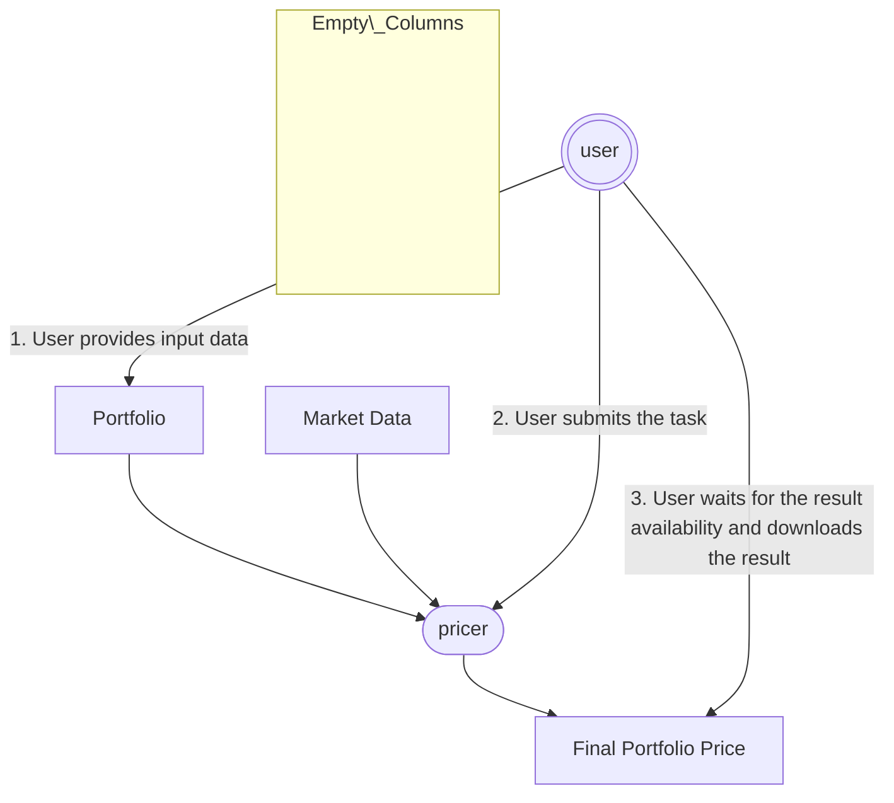

# Pricing Workflows with Pymonik

This page illustrates two common pricing workflows built on top of **ArmoniK** using **Pymonik**:

* **Scenario 1** – A simple, synchronous pricing workflow
* **Scenario 2** – A scalable, adaptive pricing workflow using subtasking and dynamic task graphs

For each scenario, we explain:

* The **end-to-end workflow** from the user’s perspective
* What **ArmoniK** does under the hood
* How to **implement the workflow in Python** using Pymonik

The examples assume:

* You have an ArmoniK cluster available
* You are using a Python-based worker image
* You are familiar with the basics of Pymonik tasks, invocation, and result handles

---

## Scenario 1 – Simple Pricing Workflow

### Overview

This scenario represents the simplest interaction pattern:

1. The user provides input data (market data, product definition, parameters)
2. The user submits a pricing task
3. The user waits for the result
4. The result is downloaded and returned to the user

This model is ideal for:

* Single products
* Fast pricing models
* Interactive or synchronous use cases

### Workflow Diagram



### What ArmoniK Does

* Receives a single task submission
* Schedules the task on an available worker
* Executes the pricing function remotely
* Stores the result in the distributed result store
* Makes the result available for download

No dynamic task graph or subtasking is involved.

### Example Code

```python
from pymonik import Pymonik, task

# A simple pricing task
@task
def price_vanilla(option, market_data):
    # Simplified pricing logic
    return option["notional"] * market_data["spot"] * 0.01

# User workflow
with Pymonik(endpoint="localhost:5001"):
    option = {"notional": 1_000_000}
    market_data = {"spot": 105.0}

    result = price_vanilla.invoke(option, market_data).wait().get()
    print("Price:", result)
```

### Key Characteristics

* One task → one result
* The user explicitly waits for completion
* Minimal orchestration logic
* Suitable for straightforward pricing problems

---

## Scenario 2 – Portfolio Pricing with Subtasking and Monte Carlo

### Overview

In this scenario, the pricing logic itself becomes responsible for **building and executing a task graph** dynamically.

The workflow is:

1. User provides a portfolio and market data
2. User submits a single *portfolio pricer* task
3. The pricer:

   * Prices all vanilla products
   * Builds a dynamic computation graph for complex products using Monte Carlo
   * Aggregates partial results
   * Aggregates the total portfolio value
4. The final result is **delegated** to the last aggregation task
5. The user retrieves a single portfolio-level result

This model is ideal for:

* Large portfolios
* Heterogeneous products
* Computationally intensive models (e.g. Monte Carlo)

### Workflow diagram

```mermaid
graph TB
  classDef invisibleBlock fill:#00000000,stroke-width:0px;
  classDef invisibleText color:#0000;

  %% Global Inputs
  %% Invisible inputs for Portfolio and Market Data
  subgraph global_inputs [ ]
    class global_inputs invisibleBlock
    id1["Portfolio"]
    id2["Market Data"]
    id3(["pricer"])
  end

  id1 --> id3
  id2 --> id3

  %% User Interaction
  id4((("user")))
  id4 -- "1. User provides input data" --> id1
  id4 -- "2. User submits the task" --> id3

  %% Subtasks
  subgraph subtasks [ ]
    class subtasks invisibleBlock
    columns 4

    v["Vanilla"]
    x["Complex Product 1"]
    y["Complex Product 2"]
    z["Complex Product 3"]

    %% Individual computations from Complex Products
    xc1("mc")
    xc2("mc")
    xc3("mc")
    xc4("mc")
    x --> xc1
    x --> xc2
    x --> xc3
    x --> xc4

    yc1("mc")
    yc2("mc")
    yc3("mc")
    yc4("mc")
    y --> yc1
    y --> yc2
    y --> yc3
    y --> yc4

    zc1("mc")
    zc2("mc")
    zc3("mc")
    zc4("mc")
    z --> zc1
    z --> zc2
    z --> zc3
    z --> zc4

    %% Results aggregation
    xd1["res"]
    xd2["res"]
    xd3["res"]
    xd4["res"]
    xc1 --> xd1
    xc2 --> xd2
    xc3 --> xd3
    xc4 --> xd4

    yd1["res"]
    yd2["res"]
    yd3["res"]
    yd4["res"]
    yc1 --> yd1
    yc2 --> yd2
    yc3 --> yd3
    yc4 --> yd4

    zd1["res"]
    zd2["res"]
    zd3["res"]
    zd4["res"]
    zc1 --> zd1
    zc2 --> zd2
    zc3 --> zd3
    zc4 --> zd4

    %% Aggregate results
    xa(["Aggregate"])
    ya(["Aggregate"])
    za(["Aggregate"])

    xd1 --> xa
    xd2 --> xa
    xd3 --> xa
    xd4 --> xa

    yd1 --> ya
    yd2 --> ya
    yd3 --> ya
    yd4 --> ya

    zd1 --> za
    zd2 --> za
    zd3 --> za
    zd4 --> za

    %% Product Prices
    xr["Product Price"]
    xa --> xr
    yr["Product Price"]
    ya --> yr
    zr["Product Price"]
    za --> zr

    %% Aggregate Portfolio
    pa(["Aggregate portfolio"])
    v --> pa
    xr --> pa
    yr --> pa
    zr --> pa
  end

  id3 -- "4. The pricer submits a subgraph" --> subtasks

  %% Final Results
  id5["Final Portfolio Price"]
  id4 -- "3. User waits for the result availability and downloads the result" --> id5
  pa --> id5

```

### What ArmoniK Does

* Executes the initial portfolio task
* Accepts **new task submissions from within running tasks** (subtasking)
* Dynamically extends the task graph
* Ensures dependencies are respected
* Propagates delegated results so that the parent task’s result becomes the final aggregation output

From the user’s point of view, this still looks like a **single task invocation**.

---

## Example: Portfolio Pricer with Subtasking

### Supporting Tasks

```python
import numpy as np
from pymonik import task

@task
def price_vanilla(option, market_data):
    return option["notional"] * market_data["spot"] * 0.01

@task
def mc_path(product, market_data, seed):
    rng = np.random.default_rng(seed)
    paths = rng.normal(market_data["spot"], 1.0, size=10_000)
    return np.mean(paths) * product["notional"]

@task
def aggregate_mc_results(results):
    return np.mean(results)

@task
def aggregate_portfolio(values):
    return sum(values)
```

### Complex Product Pricing via Subtasking

```python
@task
def price_complex_product(product, market_data):
    # Launch Monte Carlo paths in parallel
    mc_results = mc_path.map_invoke([
        (product, market_data, seed) for seed in range(16)
    ])

    # Delegate final product price to aggregation
    return aggregate_mc_results.invoke(mc_results, delegate=True)
```

### Portfolio Pricer (Entry Point)

```python
@task
def price_portfolio(portfolio, market_data):
    vanilla_products = [p for p in portfolio if p["type"] == "vanilla"]
    complex_products = [p for p in portfolio if p["type"] == "complex"]

    vanilla_prices = price_vanilla.map_invoke([
        (p, market_data) for p in vanilla_products
    ])

    complex_prices = price_complex_product.map_invoke([
        (p, market_data) for p in complex_products
    ])

    all_prices = vanilla_prices + complex_prices

    # Delegate final portfolio result
    return aggregate_portfolio.invoke(all_prices, delegate=True)
```

### User Code

```python
from pymonik import Pymonik

portfolio = [
    {"type": "vanilla", "notional": 1_000_000},
    {"type": "complex", "notional": 500_000},
]

market_data = {"spot": 100.0}

with Pymonik(endpoint="localhost:5001", environment={"pip": ["numpy"]}):
    result = price_portfolio.invoke(portfolio, market_data).wait().get()
    print("Portfolio value:", result)
```

---

## Summary

* **Scenario 1** demonstrates a straightforward request–response pricing model
* **Scenario 2** leverages ArmoniK’s dynamic task graph and subtasking capabilities to scale complex portfolio pricing
* Pymonik allows both workflows to be expressed naturally in Python while keeping the user-facing API simple

From a user’s perspective, both scenarios boil down to:

```python
result = some_pricer.invoke(...).wait().get()
```

The difference lies entirely in how much intelligence and orchestration is embedded inside the tasks themselves.
