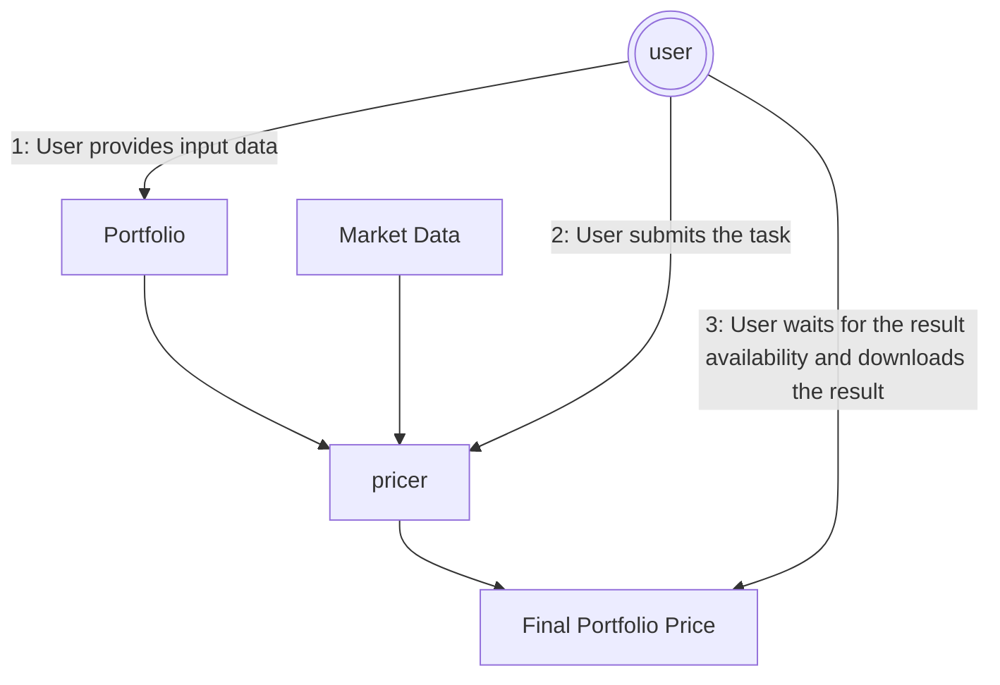
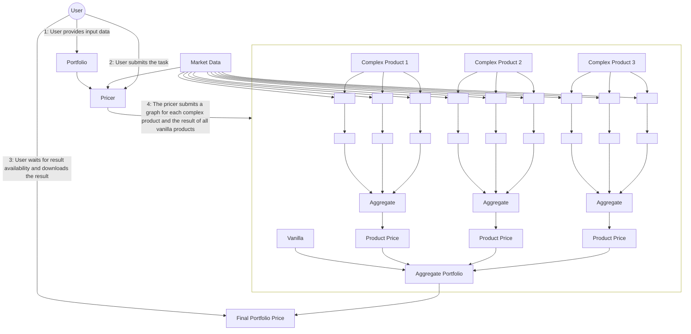

# Pricing Workflows with Pymonik

This document provides a detailed overview of two prevalent pricing workflows that are constructed using [**ArmoniK**](https://github.com/aneoconsulting/ArmoniK), a hybrid framework designed to simplify the development of distributed applications, particularly in high-performance computing (HPC) and High Throughput environments, and
[**PymoniK**](https://github.com/aneoconsulting/PymoniK), a Python framework designed to interface with ArmoniK seamlessly.

## Pricing Workflow Scenarios

The document specifically covers two distinct scenarios in order to illustrate the usage and versatility of these tools:

* **Scenario 1** – This scenario focuses on a straightforward, synchronous pricing workflow. It is designed to illustrate how pricing tasks can be executed in a linear fashion, with each step waiting for the previous one to complete before moving forward.

* **Scenario 2** – In contrast, this scenario showcases a more advanced and scalable pricing workflow that incorporates subtasking and dynamic task graphs. This approach allows for a more flexible execution of pricing tasks, enabling the system to adapt to varying demands by breaking down tasks into smaller subtasks that can run concurrently.

### Breakdown of Each Scenario

For both scenarios, the document systematically explains several key aspects:

* **End-to-End Workflow** – We provide an overview of the entire workflow from the user's point of view. This includes each interaction the user has with the system, detailing how the pricing requests are submitted and processed sequentially or concurrently.

* **ArmoniK’s Internal Functions** – An in-depth look at what happens behind the scenes within ArmoniK during the workflow execution. This includes explanations of how tasks are scheduled, resources are managed, and results are compiled to ensure efficient processing.

* **Implementation in Python** – A practical guide on how to implement each workflow scenario using PymoniK within a Python environment. This section offers code snippets and explanations to help users understand how to leverage the library effectively for their pricing needs.

### Prerequisites for Understanding the Examples

The examples provided throughout the document are based on the following assumptions :

* **ArmoniK Cluster** – It is expected that the reader has access to an operational ArmoniK cluster, which serves as the foundation for running distributed pricing tasks.

* **Python-Based Worker Image** – The document assumes that users are working with a worker image that is compatible with Python, ensuring that the examples can be executed without compatibility issues.

* **Basic Knowledge of PymoniK** – A fundamental understanding of PymoniK’s tasks, how to invoke them, and how to handle results is assumed. This prior knowledge will enable readers to follow the implementation steps more effectively.


---

## Scenario 1 – Simple Pricing Workflow

This scenario illustrates the a basic and direct pricing interaction pattern supported by ArmoniK.
It is intentionally minimal and synchronous, so it is straighforward to understand and ideal as a
starting point for new users. In this workflow:

- The user prepares all required input data locally, including:
    - Market data (e.g., spot prices, rates, volatilities)
    - Product or instrument definitions (e.g., an option with a notional)
    - Any additional pricing parameters
- The user submits a single pricing task to ArmoniK.
- The user waits synchronously for the task to complete.
- Once execution finishes, the pricing result is retrieved and returned to the user.

There is no task decomposition, no fan-out/fan-in logic, and no dependency management.
The entire pricing request is handled as one atomic unit of work.

This interaction model is particularly well suited for:

- Pricing a single financial instrument
- Lightweight or fast pricing models
- Interactive workflows (e.g., notebooks, scripts, UI-driven tools)
- Situations where immediate feedback is required

---

### Workflow Diagram

The diagram below shows the logical flow of data and control between the user, ArmoniK, and the pricing function.




Hence:

- The user is responsible for assembling the input data (portfolio definition and market data).
- The pricing task consumes these inputs and performs the computation.
- ArmoniK executes the task remotely and produces a final portfolio price.
- The user explicitly waits for the computation to complete and then retrieves the result.

### What ArmoniK Does

From ArmoniK’s point of view, this scenario follows a simple and linear execution path:

- Receives a single pricing task submission from the client
- Places the task in the scheduler queue
- Assigns the task to an available worker node
- Executes the pricing function in a distributed environment
- Persists the final result in the distributed result store
- Makes the result available for download by the client

Because the task is fully self-contained:

- No dynamic task graph is created
- No subtasks are generated
- No dependency resolution is required
- No intermediate results are exposed

### Example Code

The following example demonstrates how to define and invoke a simple pricing task using PymoniK.

```{code-block} python
:linenos:
from pymonik import Pymonik, task

# A simple pricing task
@task
def price_vanilla(option, market_data):
    # Simplified pricing logic
    return option["notional"] * market_data["spot"] * 0.01

# User workflow
with Pymonik(endpoint="localhost:5001"):
    option = {"notional": 1_000_000}
    market_data = {"spot": 105.0}

    result = price_vanilla.invoke(option, market_data).wait().get()
    print("Price:", result)
```

#### Step-by-Step Explanation

##### Task definition:

* Line 1 imports the ArmoniK client (Pymonik) and the `@task` decorator.
* Line 4 marks `price_vanilla` as a remotely executable ArmoniK task.
* Lines 5–7 define the pricing logic. All required inputs are passed as arguments, making the task fully self-contained and serializable.

##### User workflow:

* Line 10 opens a connection to the ArmoniK control plane using a context manager. Here we assume that the cluster is listening on `localhost` at port `5001`.
* Lines 11-12 define the product data and market data locally on the client.
* Line 14 submits the task for execution, waits synchronously for completion, and retrieves the result.
* Line 15 outputs the final price to the user.

From the user’s perspective, the call behaves much like a local function call, while ArmoniK transparently handles remote execution and scheduling.

### Take-away messages

- One task → one result
- The user explicitly waits for completion
- Minimal orchestration logic
- Suitable for straightforward pricing problems

---

## Scenario 2 – Portfolio Pricing with Subtasking and Monte Carlo

In this scenario, the pricing logic itself takes responsibility for orchestrating the computation. Rather than submitting many independent tasks from the client side, the user submits a single, high-level portfolio pricer task. At runtime, this task dynamically constructs and executes a task graph based on the actual contents of the portfolio.
As a result, orchestration is shifted away from the user and into the pricing logic. This allows complex workflows to be defined within the computation itself, instead of being fixed at submission time.

At a high level, this means that:

- The user interacts with ArmoniK only once.
- All task creation, fan-out, and aggregation are handled transparently inside the portfolio pricer.
- The user ultimately receives a single, aggregated portfolio value.

Because of this design, the execution model is particularly well suited for:

- Large portfolios containing many instruments.
- Heterogeneous product mixes, including both vanilla and exotic products.
- Computationally intensive models, such as:
    - Monte Carlo simulations
    - Scenario-based pricing
    - Path-dependent products
- Situations in which:
    - The computation structure cannot be determined upfront
    - Task creation depends on intermediate results

---

### Workflow Diagram

The diagram below expresses the workflow for this second scenario:



The execution flow proceeds as follows:

1. The user prepares and provides:
   * A portfolio containing multiple financial instruments
   * The associated market data required for pricing
2. The user submits one portfolio pricer task to ArmoniK.
3. The portfolio pricer executes and:
   * Identifies and prices all vanilla products directly
   * Detects complex products requiring advanced models
   * Dynamically constructs a computation graph for those products
   * Launches Monte Carlo or other heavy computations as subtasks
   * Collects and aggregates partial pricing results
4. A final aggregation task computes the total portfolio value.
5. The user retrieves a single portfolio-level result.

From the client’s point of view, the interaction remains simple and synchronous. The user submits one task and receives one result, even though the internal execution may involve hundreds or thousands of distributed tasks running in parallel. This abstraction is made possible because, within the ArmoniK framework, the portfolio pricer itself can act as a **runtime orchestrator**.

- It inspects the portfolio composition.
    - For vanilla instruments:
        - Pricing is performed directly within the main task or via lightweight subtasks.
    - For complex instruments:
        - A dynamic task graph is built.
        - Monte Carlo simulations are split into many independent subtasks.
        - Each subtask computes partial statistics (e.g. payoffs, paths). These partial results are progressively collected and combined as the computation advances.

### What ArmoniK Does

ArmoniK provides the execution backbone that makes this model possible. In particular, it:

- Executes the initial portfolio pricer task
- Allows running tasks to submit new tasks dynamically (subtasking)
- Dynamically extends the task graph as new computation paths are discovered
- Tracks and enforces task dependencies to ensure correct execution order
- Manages result propagation so that delegated subtask results are routed back to their parent tasks
- Ensures that the parent task’s result becomes the final aggregated portfolio output

Despite the complexity of the internal execution, from the user’s perspective this still appears as a single task invocation producing a single result. All orchestration, parallelization, and aggregation are handled transparently by the portfolio pricer and the ArmoniK runtime.

---

## Example Code

The following example demonstrates how to define and invoke the pricing task explained above using PymoniK. Each code
block is followed by a step-by-step explanation.

### Supporting Tasks

```{code-block} python
:linenos:
import numpy as np
from pymonik import task

@task
def price_vanilla(option, market_data):
    return option["notional"] * market_data["spot"] * 0.01

@task
def mc_path(product, market_data, seed):
    rng = np.random.default_rng(seed)
    paths = rng.normal(market_data["spot"], 1.0, size=10_000)
    return np.mean(paths) * product["notional"]

@task
def aggregate_mc_results(results):
    return np.mean(results)

@task
def aggregate_portfolio(values):
    return sum(values)
```

- Lines 4–6 handle simple vanilla products directly.
- Lines 8–12 implement a Monte Carlo simulation for complex products.
- Lines 14–20 define aggregation tasks to combine partial results.

### Complex Product Pricing via Subtasking

```{code-block} python
:linenos:
@task
def price_complex_product(product, market_data):
    # Launch Monte Carlo paths in parallel
    mc_results = mc_path.map_invoke([
        (product, market_data, seed) for seed in range(16)
    ])

    # Delegate final product price to aggregation
    return aggregate_mc_results.invoke(mc_results, delegate=True)
```

- Line 4–6: map_invoke runs multiple Monte Carlo simulations in parallel, each with a different seed.
- Line 9: delegate=True tells ArmoniK that the aggregation result will replace the parent task’s result, making orchestration seamless.

### Portfolio Pricer (Entry Point)

```{code-block} python
:linenos:
@task
def price_portfolio(portfolio, market_data):
    vanilla_products = [p for p in portfolio if p["type"] == "vanilla"]
    complex_products = [p for p in portfolio if p["type"] == "complex"]

    vanilla_prices = price_vanilla.map_invoke([
        (p, market_data) for p in vanilla_products
    ])

    complex_prices = price_complex_product.map_invoke([
        (p, market_data) for p in complex_products
    ])

    all_prices = vanilla_prices + complex_prices

    # Delegate final portfolio result
    return aggregate_portfolio.invoke(all_prices, delegate=True)
```

- Lines 3–4: Separate the portfolio into vanilla and complex products.
- Lines 6–8: Price all vanilla products in parallel using map_invoke.
- Lines 10–12: Price complex products using the dynamic Monte Carlo subtasks.
- Line 14: Combine all results.
- Line 17: Delegate the final portfolio sum, ensuring the portfolio pricer task returns the total value transparently.

### User Code

```{code-block} python
:linenos:
from pymonik import Pymonik

portfolio = [
    {"type": "vanilla", "notional": 1_000_000},
    {"type": "complex", "notional": 500_000},
]

market_data = {"spot": 100.0}

with Pymonik(endpoint="localhost:5001", environment={"pip": ["numpy"]}):
    result = price_portfolio.invoke(portfolio, market_data).wait().get()
    print("Portfolio value:", result)
```

- Lines 3–6: Define a sample portfolio with one vanilla and one complex product.
- Line 8: Provide market data needed for pricing.
- Line 10: Initialize a PymoniK client session connecting to the ArmoniK server.
- Line 11: Invoke the portfolio pricer task. .wait().get() blocks until the result is ready.
- Line 12: Print the final portfolio value.

---

### Take-away messages

-  Dynamic Orchestration: Complex product pricing uses subtasks that are launched dynamically, depending on the portfolo content.
-  Delegation: Aggregation tasks replace parent task results seamlessly, giving the user the appearance of a single synhronous invocation.
-  Parallelism: map_invoke allows Monte Carlo paths and vanilla product pricing to execute in parallel, maximizing resorce utilization.
-  User Simplicity: From the user perspective, only one task is submitted, and a single portfolio-level result is returned.

## Summary

* **Scenario 1** demonstrates a straightforward request–response pricing model
* **Scenario 2** leverages ArmoniK’s dynamic task graph and subtasking capabilities to scale complex portfolio pricing
* Pymonik allows both workflows to be expressed naturally as Python code while keeping the user-facing API simple

From a user’s perspective, both scenarios boil down to:

```python
result = some_pricer.invoke(...).wait().get()
```

The difference lies entirely in how much intelligence and orchestration is embedded inside the tasks themselves.
