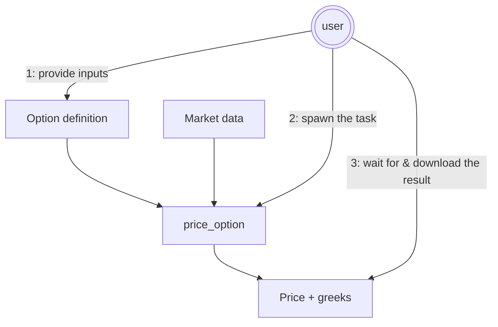
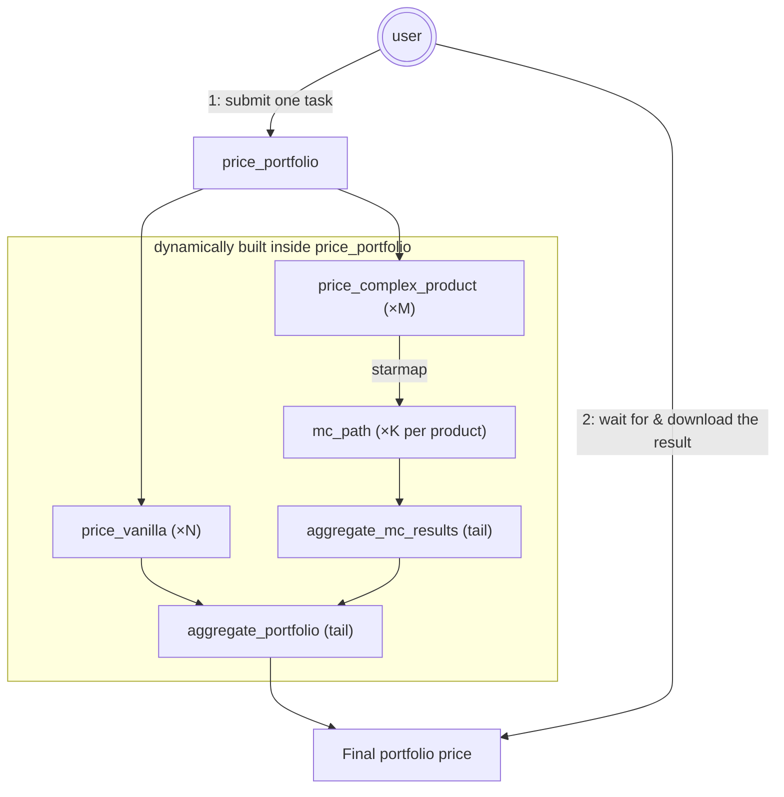

# Pricing workflows

Two patterns for financial pricing on ArmoniK, side by side: a simple
synchronous workflow that prices one instrument, and a fan-out/fan-in
workflow where the pricing task itself orchestrates a dynamic graph of
subtasks. A runnable Marimo version lives at
`examples/marimo/marimo_pricing_workflow.py`.

## Why pricing on ArmoniK

Pricing financial instruments is a natural fit for ArmoniK:

- **Embarrassingly parallel** for portfolio pricing (every instrument
  is independent).
- **Heterogeneous task sizes** (a vanilla call is microseconds; a
  Bermudan swaption with Monte Carlo paths is seconds-to-minutes).
- **Bursty demand** (end-of-day risk runs, intraday what-if analysis,
  one-off scenario shocks).

PymoniK handles the scheduling; you write the pricing math.

## The cardinal rule: tasks delegate, they don't wait

A `@task` runs on a worker and is meant to be **short and ephemeral**. It
must **never call `.result()`** (nor `.results()` / `await future`) on a
subtask it spawned — a worker that blocks waiting on its own children ties
up a slot and can deadlock the cluster when every worker is doing the same.

Instead, when a task needs to fan out and then combine, it **delegates**
its output to an aggregator with `tail`:

```python
return aggregate.tail(child_futures, ...)   # hand my output to `aggregate`
```

`other.tail(args)` retargets the parent's `expected_output_id` to `other`.
ArmoniK schedules `other` to run once the child futures resolve, delivers
its result to whoever was awaiting the parent, and the parent's worker
returns immediately. The child futures passed as arguments become
`data_dependencies` — the aggregator receives the resolved values, not the
futures.

**`.result()` is a client-side call only** — the user, outside any task,
blocking on the final answer. (The retired `_delegate=True` kwarg raises a
`PymonikError` now; use `tail`.)

## Scenario 1 — Single-instrument synchronous pricing

The simplest possible workflow: one task in, one price out.



```python
from pymonik import PymonikClient, task

@task
def price_option(market_data: dict, option_def: dict, params: dict) -> dict:
    """Black-Scholes price + greeks for a vanilla European option."""
    spot   = market_data["spot"]
    rate   = market_data["rate"]
    sigma  = market_data["volatility"]
    strike = option_def["strike"]
    tte    = option_def["time_to_expiry"]
    is_call = option_def["type"] == "call"

    price = compute_bs_price(spot, strike, tte, rate, sigma, is_call)
    delta = compute_bs_delta(...)
    vega  = compute_bs_vega(...)

    return {
        "price": price,
        "greeks": {"delta": delta, "vega": vega},
        "valuation_id": params["valuation_id"],
    }


def run() -> dict:
    market = {"spot": 100.0, "rate": 0.05, "volatility": 0.2}
    option = {"type": "call", "strike": 105.0, "time_to_expiry": 0.5,
              "notional": 1_000_000}
    params = {"valuation_id": "single-001"}

    with PymonikClient() as client:
        with client.session(partition="pymonik") as s:
            return price_option.spawn(market, option, params).result(timeout=30)
```

Three things worth noting:

- The function is plain Python — no ArmoniK API surface inside the math.
  The decorator is the only PymoniK touch.
- All inputs and outputs are JSON-serialisable dicts. PymoniK doesn't
  require this — it cloudpickles whatever you pass — but it keeps
  log/debug output legible.
- One submission, one wait. The `.result()` here is **client-side**, which
  is exactly where blocking belongs. Suitable for "price this and show me
  the answer", interactive notebooks, UI-driven tools.

## Scenario 2 — Portfolio pricing with subtasking and Monte Carlo

Now the pricing logic itself orchestrates the computation. The user submits
a single high-level `price_portfolio` task; at runtime that task inspects
the portfolio and **builds a task graph from the actual contents** — vanilla
instruments priced directly, complex instruments fanned out into Monte Carlo
subtasks, every branch aggregated by delegation.

From the client's side it's still one submit, one result — even though the
internals may be thousands of tasks.



### Supporting tasks

```python
import numpy as np
from pymonik import task

@task
def price_vanilla(option: dict, market_data: dict) -> float:
    return option["notional"] * market_data["spot"] * 0.01

@task(deps=["numpy"])
def mc_path(product: dict, market_data: dict, seed: int) -> float:
    rng = np.random.default_rng(seed)
    paths = rng.normal(market_data["spot"], 1.0, size=10_000)
    return float(np.mean(paths) * product["notional"])

@task(deps=["numpy"])
def aggregate_mc_results(results: list[float]) -> float:
    return float(np.mean(results))

@task
def aggregate_portfolio(values: list[float]) -> float:
    return sum(values)
```

- `price_vanilla` handles simple products directly.
- `mc_path` is one Monte Carlo simulation; many run in parallel, each with
  a different seed.
- the two `aggregate_*` tasks combine partial results — they're the
  delegation targets.

### Complex-product pricing via subtasking

```python
@task
def price_complex_product(product: dict, market_data: dict) -> float:
    # Fan out Monte Carlo paths — one subtask per seed.
    mc_results = mc_path.starmap(
        (product, market_data, seed) for seed in range(16)
    )
    # Delegate this task's output to the aggregator. No .result() here:
    # the worker returns immediately; ArmoniK runs aggregate_mc_results
    # once all 16 paths resolve and routes its value back as ours.
    return aggregate_mc_results.tail(mc_results)
```

`mc_path.starmap(...)` submits all 16 paths in one batched RPC. The
`FutureList` is handed straight to `aggregate_mc_results.tail(...)`; PymoniK
walks it, rewrites each future as a `data_dependency`, and the aggregator
receives the resolved list of payoffs.

### Portfolio pricer (entry point)

```python
@task
def price_portfolio(portfolio: list[dict], market_data: dict) -> float:
    vanilla = [p for p in portfolio if p["type"] == "vanilla"]
    complex_ = [p for p in portfolio if p["type"] == "complex"]

    vanilla_prices = price_vanilla.starmap(
        (p, market_data) for p in vanilla
    )
    complex_prices = price_complex_product.starmap(
        (p, market_data) for p in complex_
    )

    # Flatten both FutureLists into one list of futures (FutureList is
    # iterable; dep-extraction recurses through the list).
    all_prices = [*vanilla_prices, *complex_prices]

    # Delegate the portfolio total — again, no waiting on the worker.
    return aggregate_portfolio.tail(all_prices)
```

Note the recursion of delegation: `price_portfolio` delegates to
`aggregate_portfolio`, and each `price_complex_product` independently
delegates to its own `aggregate_mc_results`. No task anywhere blocks on a
child; ArmoniK's dependency tracking sequences the whole graph.

### User code

```python
from pymonik import PymonikClient

portfolio = [
    {"type": "vanilla", "notional": 1_000_000},
    {"type": "complex", "notional": 500_000},
]
market_data = {"spot": 100.0}

with PymonikClient() as client:
    with client.session(partition="pymonik") as s:
        result = price_portfolio.spawn(portfolio, market_data).result(timeout=300)
        print("Portfolio value:", result)
```

The only `.result()` in the whole workflow is this one, on the client.

### What ArmoniK does

- Executes the initial `price_portfolio` task.
- Lets that running task submit new tasks (subtasking) and extends the
  task graph as branches are discovered.
- Tracks data dependencies so each `aggregate_*` runs only after its inputs
  resolve.
- Routes delegated (`tail`) results back to the original awaiter, so the
  client's single future resolves to the final portfolio value.

## Scaling it up

End-of-day risk runs price thousands of instruments under hundreds of
scenarios. The same shape scales: have `price_portfolio` (or a dedicated
scenario task) `starmap` across the cross-product of trades and scenarios,
then delegate the fan-in.

```python
@task
def price_scenarios(portfolio: list[dict], scenarios: list[dict],
                    market: dict) -> float:
    jobs = [
        (apply_shock(market, sc), trade)
        for sc in scenarios for trade in portfolio
    ]
    priced = price_vanilla.starmap(jobs)     # one batched submission
    return aggregate_portfolio.tail(priced)
```

For 10,000 trades × 100 scenarios = 1M tasks, PymoniK submits in batched
RPCs (32-task batches by default) and streams results back via the events
stream as they resolve.

## Operational notes

- **Use blobs for shared market data.** If `market` is large (full vol
  surfaces, yield curves), upload it once and pass the blob handle to every
  task instead of inlining it. See
  [Blobs and Materialize](../guides/blobs-and-materialize.md).
- **Use multi-partition for heterogeneous compute.** Vanilla pricing on a
  CPU partition; Monte Carlo on a GPU partition:
  `client.session(partition=["cpu", "gpu"])` plus
  `mc_path.with_options(partition="gpu")`.
- **Trace it.** Pricing pipelines are exactly the workload OTel was
  designed for: a deep DAG with fan-in steps that depend on thousands of
  upstreams. See [Observability](../guides/observability.md).
- **Cache for what-if iterations.** Re-running identical pricing is
  wasteful. `PymonikClient(cache=True)` and `@task(cache=True)`
  short-circuit identical re-submissions.

## Take-aways

- **Tasks delegate, they don't wait** — `return other.tail(...)`, never
  `other.spawn(...).result()` inside a `@task`.
- **Dynamic orchestration** — `price_portfolio` builds its graph from the
  portfolio's contents at runtime.
- **Parallelism** — `starmap` fans Monte Carlo paths and vanilla pricing
  out across the cluster in one submission.
- **User simplicity** — from the client, both scenarios are
  `some_pricer.spawn(...).result()`. The difference is how much
  orchestration lives inside the tasks.
```
